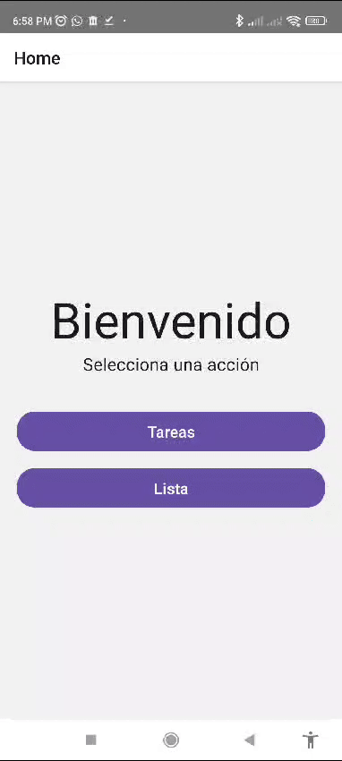

# Proyecto Novacomp

## instalación

Para instalar el proyecto, primero debes clonar el repositorio:

```bash
git clone
```

Luego, debes instalar las dependencias:

```bash
yarn install
```

Finalmente, puedes correr el proyecto con el siguiente comando:

```bash
yarn start
```

En el directorio principal del proyecto encontrarás un archivo llamado app.apk, el cual puedes instalar en tu dispositivo móvil para probar la aplicación.

Aquí puedes ver una demostración de la funcionalidad principal:


